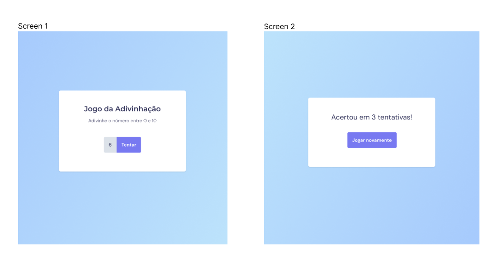

<h1 align="center"> Jogo de Adivinhação</h1>

  <a href="#-tecnologias">Tecnologias</a>&nbsp;&nbsp;&nbsp;|&nbsp;&nbsp;&nbsp;
  <a href="#-projeto">Projeto</a>&nbsp;&nbsp;&nbsp;|&nbsp;&nbsp;&nbsp;
  <a href="#-layout">Layout</a>

 

  

## 🚀 Tecnologias

Esse projeto foi desenvolvido com as seguintes tecnologias:

- HTML e CSS
- Javascript
- Git e Github

## 💻 Projeto

Este projeto foi desenvolvido em aula do Stage 05: Avançando com JavaScript, do curso Explorer da Rocketseat para aprendizado de eventos e manipulação de DOM.

Você pode visualizar o projeto através [DESSE LINK](https://viviansanchez.github.io/rocketseat-explorer-stage05-projeto01/)!

## 🔖 Layout

Você pode visualizar o layout do projeto através [DESSE LINK](<https://www.figma.com/file/2xcVI1owapol60vt6qAzxJ/Jogo-Adivinha%C3%A7%C3%A3o-(Copy)?node-id=0%3A1&t=vqJO2srohs3Npr4c-0>). É necessário ter conta no [Figma](https://figma.com) para acessá-lo.
